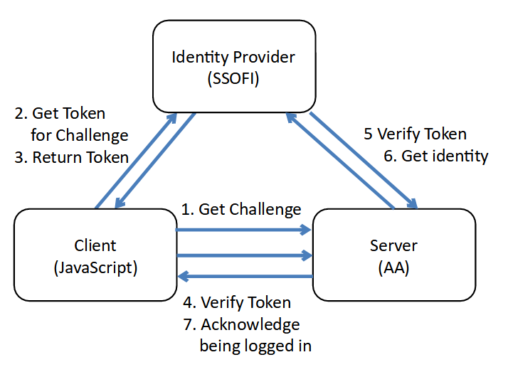

# Client Usage of SSOFI

Client programs call SSOFI using the SSOFI Lightweight Access Protocol (SLAP) which a REST/JSON protocol
to authenticate to a server and a third party identity provider.

## Protocol Overview

Users log into SSOFI in the normal way: they enter a password.  This password is transferred only over a secure encrypted link, and it is shared only with the SSOFI server.  SSOFI stores an encrypted token which can tell if the user entered the correct password, but there is no way for a hacker to get the password from SSOFI.  SSOFI offers the standard features for recovering and resetting passwords through email.

Once the user is logged in to SSOFI, the SLAP protocol is used by applications to find out reliably and safely who the user is. This authentication requires a dance between three parties:

* The user is operating a browser and we call that a `client`.  We assume JavaScript is running on the client.  We can not trust the client because any hacker can set up a web page with JS in it in an attempt to gain access to the application you are protecting with authentication.   the entire protocol works in such a way that we can authenticate the user without needing to trust the browser.
* The service side of the application wants to know who the user is, and we call that the `server`.  The server is not trusted with the password from the user, and the user does not worry that the server might take the password and misuse it by accessing other services.  Instead the server receives information on who the user is that logged in, without revealing the password of the user.
* SSOFI is then called an `identity provider`.  The client gets a challenge from the `server` and uses that to get a token from SSOFI.  The token is given to the `server` and finally the token and challenge are used to obtain the identity of the user who is logged in.  



This may seem at first glance complicated, but the SSOFI side of the protocol is completedly implemented, there is a JS client library for running in a browser, and the implementation in the server is straightforward.  This small amount of work yeilds the following benefits:

* Users log in once, and then can use any number of applications
* None of those applications have access to the password, so the user is safe
* Password recover and maintenance is taken care of for all applications
* SSOFI is already available on a secure server for use
* Users across applications can be coordinated to provide a unified, integrated service
* Applications can be hosted anywhere on the internet.  Parts of applications can be different places
* SLAP protocol works through all proxy servers and all kinds of network connections
* SSOFI is free to use on existing servers
* SSOFI is open source and free for anyone who wants to run their own identity provider

SSOFI makes distributed application development easier by taking the entire burden of authentication out of the application, and into a standard very secure service.

# SLAP CLient Library

SSOFI provides a JavaScript client library to implement all the interactions that are needed in a client web application.  it is called `slap.js` and is easily incorporated into any web UI that needs to allow users to log in.  Below is a description of the client library and how to use it.

## SLAP.initLogin

Start everything with a call to `initLogin` which will discover the users identity and log into
the server if necessary.  The three parameters are `loginConfig, loginInfo, statusCallback`.  If the user needs to login, the browser will be redirected to allow them to login, and then directed back to the current page.  The client application need not be concerned with this redirection, it just needs to listen to the callback saying that the user is logged in.

```
loginConfig = {
    "providerUrl": (url to identity provider api),
    "serverUrl": (url to server auth api)
}
```

The first parameter needs a structure like above.  The `providerUrl` is the HTTP web address of the existing SSOFI server, and currently a public server is available at `https://s06.circleweaver.com/ssofi` .  The `serverURL` is the web address of the server application that the user needs to authenticate to.  If you are implementing a client, then this is the server side of the application that giving access to resources for that user.  


```
loginInfo = {
    "email": "kswenson@fujitsu.com",
    "emailConfirmed": false,
    "go": "http://bobcat/weaver/t/index.htm",
    "isLDAP": false,
    "isLocal": true,
    "isLoggedIn": true,
    "msg": "Logged In",
    "presumedId": "kswenson@fujitsu.com",
    "source": "UI:kswenson@fujitsu.com",
    "ss": "SZBC-BE-INL-BD-OUH",
    "userId": "kswenson@fujitsu.com",
    "userName": "Keith 🥴 Swenson"
}
```

This structure is managed by the SLAP library, so this can be an empty object initially, but this object will collect information as the protocol proceeds.  You can persist this structure to preserve login from browser session to session if you wish.  Some of the aspects of the protocol have timeouts, and so the user might be required to log in again if it has been too long, but the client library will take care of that for you.

`statusCallback` is a function that takes loginInfo as a parameter.  Every time
the login state is changed, this callback is called.  You can use this function to update the user interface as the login proceeds.  Most important: when the user is ultimately authenticated a call to this function will tell the client application.

## SLAP.loginUserRedirect

When you know that the user is not logged in, you can present a button on the UI to allow the user to log in.  If the user has an existing session, SSOFI will return immediately with the authenticated user information to complete the rest of the login protocol.  If the user does not have an existing session, then the pogin prompt will appear.

## SLAP.logoutUser

Use 'logoutUser' to logout.  This will inform the `server` and the `identityProvider` that the user wishes to be logged out and terminates the session that was ongoing.   When logged out, the statusCallback will be called again, with no user name or id in it to inform the client application to display as if the user is not logged in.

## SLAP.sendInvitationEmail

This is a special function to use when inviting a user to the system.  SSOFI will create an encrypted single-use token and place it into the link in the email message that it sends.  When the user clicks on the link, it will immediately allow the user to set the password (or log in if they already have a password).  The key here is that the email address is already confirmed because SSOFI sent the link to the desired email address, and the user must have the email address if they are clicking on the link.  Without this feature the user would need to confirm their email address separately.  This function is not normally required, but it just saves a step in the signup process for new users.


